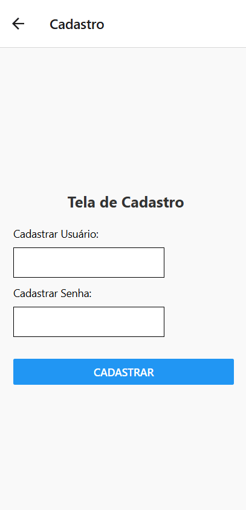
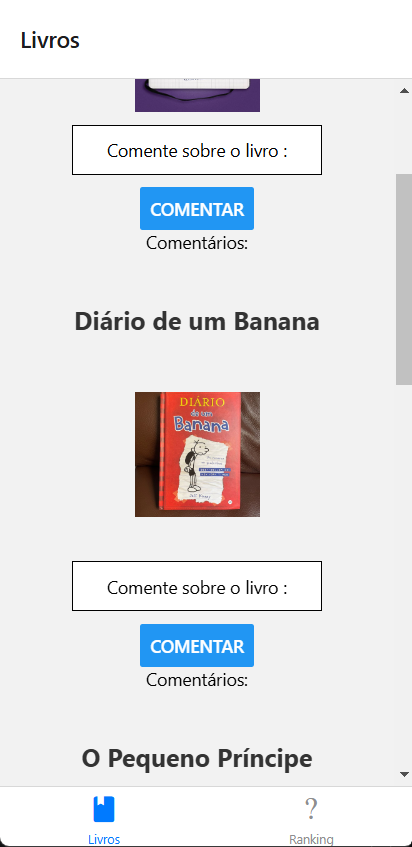
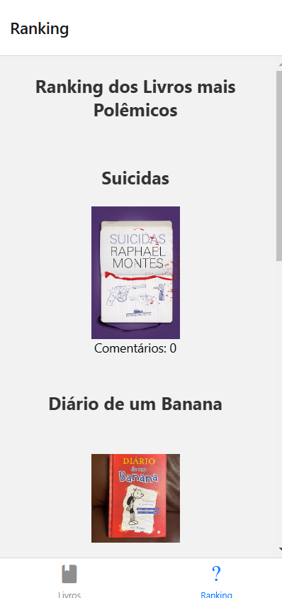

# Projeto Computação Móvel

## 📖 Introdução
O **Projeto Computação Móvel** é um site desenvolvido para apaixonados por livros que desejam compartilhar suas opiniões e discutir as obras mais populares do momento. O site conta com um **ranking dinâmico**, que organiza os livros de acordo com a quantidade de comentários recebidos, destacando os títulos mais comentados e polêmicos.  

Para participar das discussões, o usuário precisa criar uma conta, garantindo a segurança e a personalização da experiência. Essa ideia surgiu da convivência com leitores ávidos que desejavam um espaço exclusivo para expressar suas opiniões sobre literatura.  

---

## 💡 Inspiração
A ideia do projeto nasceu da observação de como leitores gostariam de um espaço online para debater suas impressões sobre livros. Este site busca oferecer exatamente isso: uma comunidade digital interativa e acolhedora para os amantes de literatura.  

---

## 🚀 Funcionalidades

### 🌟 Tela Inicial
**Descrição:**  
A tela inicial permite que o usuário faça login no sistema. Caso ainda não tenha cadastro, será redirecionado para a página de cadastro.

---

### 📝 Tela de Cadastro
**Descrição:**  
Nesta tela, os usuários podem criar uma conta informando um nome de usuário e senha. Com o cadastro, eles terão acesso ao site e poderão comentar nos livros.

---

### 📚 Tela dos Livros
**Descrição:**  
Apresenta uma lista de livros disponíveis. Os usuários podem selecionar qualquer título para adicionar seus comentários. Importante: apenas comentários não vazios são computados.

---

### 🏆 Tela de Ranking
**Descrição:**  
Mostra o ranking dos livros mais comentados, permitindo que os usuários visualizem quais obras estão gerando mais engajamento e discussões.

---

### 🎯 Conclusao:

A ideia do projeto foi um sucesso, consegui alcançar os obejtivos solicitados para o projeto. Durante a execução do código tive dificuldade em armazenar os comentários realizados pelo usuário, mas consegui superar esses desafios, o que contribui significativamente para o meu aprendizado pessoal.

